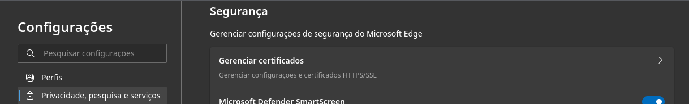
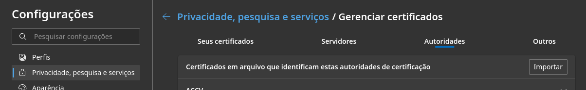
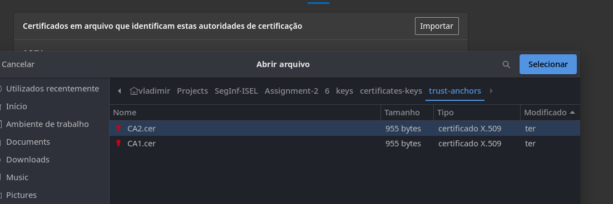
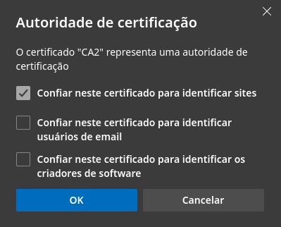
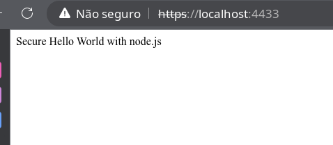
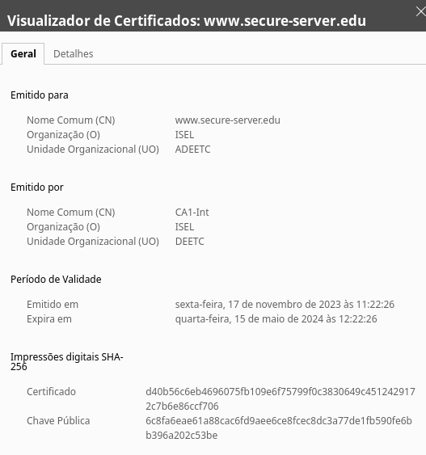
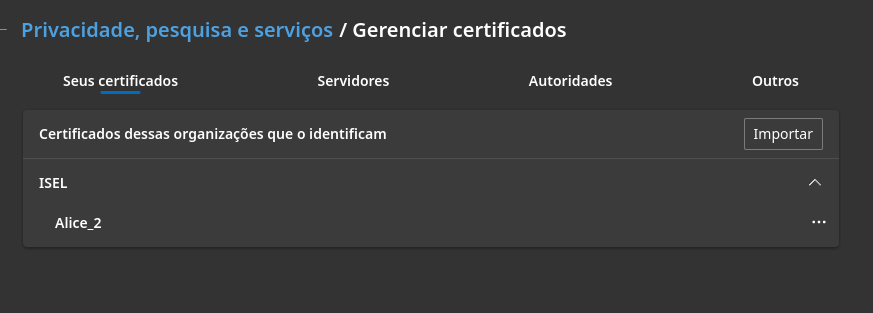
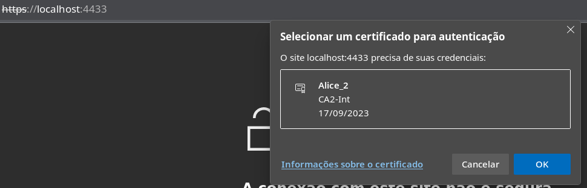

# Assignment 2 responses

## 1. Protocolo TLS

### a) Motivo pelo qual a propriedade *perfect forward secrecy* não é garantida usando o processo base com RSA para estabelecimento do **master_secret**

A troca de chaves com RSA implica que o browser use a chave pública do servidor para cifrar o *pre master secret*, por sua vez, este (servidor), decifra o *pre master secret* com a sua chave privada. Este processo é seguro e garante a confidencialidade do *pre master secret* se a chave privada não for comprometida. Caso isso aconteça, o *pre master secret* dos *handshakes* seguintes e dos anteriores (guardados pelo atacante) podem ser decifrados, comprometendo assim a propriedade *perfect forward secrecy* do *handshake*.
> TODO: ver slide 18 de 07.SSL-TLS.pdf

### b) Dois possíveis ataques ao *record protocol* e técnicas usadas para os prevenir

| Ataque | Mitigação|
| ------ | -------- |
| Repetição de mensagens | Uso de números de sequência |
| Reflexão da mensagem | Uso de MACs diferentes em cada ligação |
| Reutilização do *keystream* (criptografia simétrica baseada em streams) | Uso de chaves e IVs separados para cada direção |
| Análise de tráfego | Uso de chaves criptográficas diferentes |
> TODO: confirmar. usados apontamentos do caderno

## 2. Validação da informação de *password* em *Web App*

Validação da informação da *password* através da forma **h<sub>u</sub> = H(pwd<sub>u</sub> || salt<sub>u</sub>)**

- **H** - função de *Hash*
- **pwd<sub>u</sub>** - *password* do utilizador *u*
- **salt<sub>u</sub>** - número aleatório gerado no momento do registo do utilizador *u*
- **||** - concatenação de bits

Explique se a técnica CAPTCHA contribui para mitigar ataques de dicionário à informação de validação.

Os ataques de dicionário não iriam funcionar com este tipo de validação da informação da password, uma vez que a própria aplicação, aquando do registo de utilizador lhe adiciona um *salt*, inviabilizando assim os ataques de dicionario. No entanto, é útil para mitigar ataques de *Brute force*, uma vez que por cada tentativa de password é necessário preencher / resolver o CAPTCHA.
> TODO: confirmar. usado lógica e cultura geral

## 3. Detetação no servidor de aldulteração de Cookie pelo browser

Considerando uma aplicação *web* que mantém estado de autenticação entre o *browser* e a aplicação servidor usando *cookies*, e que, no *cookie* é guardado um **JSON web token (JWT)** com o identificador do utilizador, a deteção da alteração do conteúdo do cookie pelo servidor pode ser implemantada ao criar o *cookie* com autenticadores através de:

- Identificador de sessão
  - Informação sobre a sessão presente no servidor
  - *Cookie* possui o identificador para aceder a essa informação
  - Utilização de criptografia na geração de números aleatórios para que seja computacionalmente infazível criar um identificador válido.
- *Message Authentication Code*
  - Informação sobre a sessão presente no *cookie**
  - *Cookie* protegido por um MAC
  - Caso a confidencialidade seja um requisito, cifrar o conteúdo do *cookie*
- Mecanismo de validade temporal próprio
  - Presente na informação de sessão presente no *cookie* (protegido por MAC)
- Mecanismo de *Logout*/Revogação
  - Invalidar a sessão
  - Após *logout*, colocar o *cookie* numa lista de revogação (até que a data do mesmo expire).
- Proteção dos *Cookies*
  - No transporte através da utilização de SSL - *flag* **Secure**
  - No cliente através da *flag* **HttpOnly**
- Proteção contra **Cross-Site Request Forgery**
  - Através da marcação do *cookie* com a opção **SameSite=Strict**

> TODO: ver slides 22 a 26 de 09.HTTP-Autenticação

## 4. **OAuth 2.0** e **OpenID Connect** no fluxo *authorization code grant*

### a) Em que situação está previsto o uso da estrutura **JWT** e com que objetivo

> TODO

### b) No *OAuth 2.0*, após o dono de recursos ter autorizado e consentido o uso de um recurso, descreva as ações da aplicação cliente para conseguir fazer os pedidos ao servidor de recursos.

> TODO

## 5. Controlo de Acessos **RBAC<sub>1</sub>**

Para os papeis de *(M)ember, (D)eveloper, (T)ester* e *(S)upervisor*, foi defenida a seguinte política:

- *U = {u<sub>1</sub>, u<sub>2</sub>, u<sub>3</sub>, u<sub>4</sub>}*
- *RH = {M ⪯ T, M ⪯ D, D ⪯ S, T ⪯ S, T ⪯ T<sub>2</sub>, D ⪯ D<sub>2</sub>}* 
- *UA = {(u<sub>1</sub>, M),(u<sub>2</sub>, T<sub>2</sub>),(u<sub>3</sub>, D<sub>2</sub>),(u<sub>4</sub>, S)}*
- *P A = {(M, p1),(D, p2),(T, p3),(D<sub>2</sub>, p5),(T<sub>2</sub>, p4)}*

Numa sessão utilizador *u<sub>4</sub>* , o conjunto total de permissões que podem existir são ```TODO``` uma vez que, ```TODO```

## 6. Servidor HTTPS

### OpenSSL comands to transform the certificate keys

Not necessary anymore, since that in the [Moodle](https://2324moodle.isel.pt/course/view.php?id=7503), the new certificates are already in the ```*.pem``` format:

```terminal
openssl x509 -inform de -in secure-server.cer -out secure-server-cer.pem
```

```terminal
openssl pkcs12 -in secure-server.pfx -out secure-server-pfx.pem -nodes -legacy
```

But the CA2.cer from the trust-anchors stil needs to be transformed to ```.pem```.

```terminal
openssl x509 -inform des -in CA2.cer -out CA2.pem
```

#### Node server

To run the server:

```terminal
node https-server-base.js
```

#### Browser configurations

##### In the browser is necessary to add the root certificate.

- Open the browser ```settings```
    

- Then in ```manage certificates``` -> ```Autorities``` do ```Import```
    

    

- At last, trust the certificate to identifie sites

    

- When visiting the server ```https://localhost:4433``` the result is:
    

- And clicking the the lock to view the certificate, it shows:
    

##### Login with Alice_2 certificate

- Add Alice certificate, same procedure but using the ```My certificates``` tab
    

- When visiting the server, the browser asks to select the certificate to use:
    

- And open the web page:

    

In the node console, it prints:

```terminal
Server started at port 4433
::1 Alice_2 GET /
```

showing that the server has accepted and validated the ```Alice_2``` certificate.

#### Javascript Code

```javascript
// Built-in HTTPS support
const https = require("https");
// Handling GET request (npm install express)
const express = require("express");
// Load of files from the local file system
var fs = require('fs'); 

const PORT = 4433;
const app = express();

// Get request for resource /
app.get("/", function (req, res) {
    console.log(
        req.socket.remoteAddress
        + ' ' + req.socket.getPeerCertificate().subject.CN
        + ' ' + req.method
        + ' ' + req.url);
    res.send("<html><body>Secure Hello World with node.js</body></html>");
});


// configure TLS handshake
const options = {
    key: fs.readFileSync('keys/secure-server-key-17nov.pem'),
    cert: fs.readFileSync('keys/secure-server-17nov.pem'),
    ca: fs.readFileSync('keys/certificates-keys/trust-anchors/CA2.pem'),
    requestCert: true, 
    rejectUnauthorized: true
};

// Create HTTPS server
https.createServer(options, app).listen(PORT, 
    function (req, res) {
        console.log("Server started at port " + PORT);
        console.log("Access it here: https://localhost:4433")
    }
);

```

## 7. Tasks Web App

Aplicação *Web* para criar tarefas de um utilizador *Google* usando *milestones* de projetos *GitHub*

> TODO
