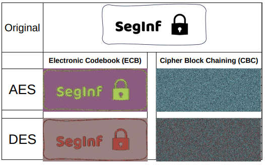

# Respostas
## Autores
Grupo 03
- 45824@nuno_venancio
- 45837@miguel_queluz
---------------
## Parte 1

1. O esquema proposto tem um problema fundamental, não cumpre os objetivos de confidencialidade e autenticidade de mensagens por causa da forma como o esquema de cifra simétrica Es(k)(m) e o esquema de *message authentication code* (MAC) T(k)(m) são usados.

    O problema é que a chave k<sub>1</sub> é usada tanto para a cifra simétrica quanto para o MAC. Isso pode levar a vulnerabilidades, pois se a chave for comprometida, tanto a confidencialidade quanto a autenticidade das mensagens serão perdidas.

    Além disso, o esquema proposto usa os primeiros L bits do MAC para a cifra simétrica. Também isto pode levar a problemas, pois se o atacante conseguir adivinhar corretamente os primeiros L bits do MAC, ele poderá decifrar a mensagem.

    Portanto, é recomendável usar chaves distintas para a cifra simétrica e para o MAC, e não usar partes do MAC na cifra simétrica. Desta forma é garantida tanto a confidencialidade quanto a autenticidade das mensagens.
2. É comum proteger e enviar chaves simétricas com esquemas de cifra assimétrica devido à segurança e eficiência que essa combinação oferece. Sendo as princi+ais razões:
    - **Segurança na troca de chaves**: A criptografia assimétrica, também conhecida como criptografia de chave pública, permite que duas partes troquem uma chave de forma segura sem a necessidade de um canal seguro pré-estabelecido. Isso é feito através do uso de um par de chaves: uma chave pública que pode ser distribuída livremente e uma chave privada que é mantida em segredo. A chave simétrica pode ser criptografada com a chave pública do destinatário e somente o destinatário com a chave privada correspondente pode descriptografá-la.
    - **Eficiência**: Embora a criptografia assimétrica seja ótima para a troca segura de chaves, ela é computacionalmente mais cara do que a criptografia simétrica. Portanto, uma vez que uma chave simétrica é compartilhada com segurança, ela pode ser usada para criptografar grandes volumes de dados de forma eficiente.
    - **Autenticação**: A criptografia assimétrica também pode ser usada para autenticar a origem da chave simétrica, garantindo que a chave seja realmente enviada pela parte pretendida.

    Portanto, a combinação de criptografia simétrica e assimétrica aproveita as vantagens de ambas: a eficiência da criptografia simétrica e a segurança da troca de chaves da criptografia assimétrica.
3. Semelhanças e diferenças entre um esquema de assinatura digital e um esquema de MAC:
    - **Semelhanças**
        - **Integridade dos dados**: ambos os esquemas são usados na verificação da integridade dos dados, garantindo assim que não foram alterados durante a transmissão.
        - **Autenticação**: tanto os MAC como as assinaturas digitais são utilizados para autenticar a origem dos dados. Eles provam que os dados vieram do remetente pretendido.
    - **Diferenças**
        - **Não repúdio**: Uma grande diferença entre os dois é que as assinaturas digitais fornecem não repúdio, o que significa que o remetente não pode negar ter enviado a mensagem. Isso é possível porque a assinatura digital é criada usando a chave privada do remetente, que se presume ser conhecida apenas pelo remetente. Por outro lado, os MACs não fornecem não repúdio, pois a mesma chave é usada para gerar e verificar o MAC.
        - **Chaves utilizadas**: Enquanto que a Assinatura Digital usa um par de chaves (chave pública e chave privada) no processo de assinatura e verificação, o MAC, usa apenas uma única chave secreta compartilhada entre remetente e destinatário.
4. Relativo aos certificados X.509 e do perfil PKIX
    
    4.1. A confiança num certificado X.509 pode variar entre diferentes sistemas (como Sa e Sb) devido a vários fatores:
    - **Lista de Autoridades de Certificação (CA) confiáveis**: Cada sistema tem uma lista de Autoridades de Certificação que considera confiáveis. Se o certificado C foi emitido por uma CA que está na lista de CA confiáveis do sistema Sa, mas não na lista do sistema Sb, então Sa confiará no certificado C, mas Sb não.
    - **Políticas de certificado**: Os sistemas podem ter diferentes políticas de certificado. Por exemplo, um sistema pode exigir que todos os certificados usem um algoritmo de assinatura específico ou tenham um comprimento de chave mínimo. Se o certificado C não atender às políticas do sistema Sb, ele não será considerado confiável por Sb, mesmo que seja considerado confiável por Sa.
    - **Revogação de certificado**: Os sistemas podem ter informações diferentes sobre a revogação de certificados. Se o sistema Sa não souber que o certificado C foi revogado, ele ainda confiará no certificado C. No entanto, se o sistema Sb souber da revogação, ele não confiará no certificado C.

    Concluindo, a confiança em um certificado depende das configurações e políticas específicas do sistema.
## Parte 2
5. Impacto da utilização dos modos de operação ECB e CBC quando a mensagem em claro tem repetição de padrões

    5.2. Comandos OpenSSL
    - **Versão do OpenSSL**:
    ```terminal
    $ openssl version
    $ OpenSSL 3.0.8 7 Feb 2023 (Library: OpenSSL 3.0.8 7 Feb 2023)
    ```
    - **AES no modo ECB**:
    ```terminal
    $ openssl enc -aes-128-ecb -in body -out body_aes_ecb -K 00112233445566778889aabbccddeeff
    $
    ```
    - **AES no modo CBC**:
    ```terminal
    $ openssl enc -aes-128-cbc -in body -out body_aes_cbc -K 00112233445566778889aabbccddeeff -iv 0102030405060708090a0b0c0d0e0f10
    $
    ```
    tanto a chave como o iv têm de ter 128-bit, 32 caracteres
    - **DES no modo ECB**:
    ```terminal
    $ openssl enc -des-ecb -in body -out body_des_ecb -K 0011223344556677 -provider legacy -provider default
    ```
    DES já não é suportado por esta versão de OpenSSL, para executar este comando, tivemos de dar os argumentos `-provider legacy -provider default`
    - **DES no modo CBC**:
    ```terminal
    $ openssl enc -des-cbc -in body -out body_des_cbc -K 0011223344556677 -iv 0102030405060708 -provider legacy -provider default
    ```
    5.3. Imagens cifradas e análise de resultados
    - **Original**
    
    - **AES no modo ECB**
    
    - **AES no modo CBC**
    
    - **DES no modo ECB**
    
    - **DES no modo CBC**
    
    - **Análise dos resultados**
    
    | Nome | Tamanho (Bytes)|Tamanho (Bits)| Total blocos |
    |------|----------------|--------------|--------------|
    |trab1.bmp|892850|7142800|
    |header|54|432|
    |body|892797|7142376|55799,8125 (128bits) 111599,625 (64bits)
    |body_aes_cbc|892800|7142400| 55800 (128bits)|
    |body_aes_ecb|892800|7142400| 55800 (128bits)|
    |body_des_cbc|892800|7142400| 111600 (64bits)|
    |body_des_ecb|892800|7142400| 111600 (64bits)|
    |aes_cbc.bmp|892854|7142832|
    |aes_ecb.bmp|892854|7142832|
    |des_cbc.bmp|892854|7142832|
    |des_ecb.bmp|892854|7142832|
    Uma vez que os modos ECB e CBC funcionam por blocos, no caso do DES, 64 bits e no caso do AES 128 bits, o programa acrescentou um *padding* de 3 bytes, tornando assim os ficheiros um pouco maiores que o original.
    
    Como é possível ver na imagem, quando é usado o modo ECB, continua a ser possível identificar a informação, pois cada bloco é cifrado independente dos restantes blocos, o que faz com que informação igual na imagem original, continue igual depois de cifrada. Já no modo CBC isto não acontece porque cada bloco é *XORado* com informação do bloco anterior, fazendo com que deste modo, cada bloco dependa de todos os blocos anteriores.


6. execice6.Blockchain

    6.3. A alteração do valor da transação no bloco 10 afetaria o hash desse bloco, pois o hash é calculado com base nos dados da transação. Como cada bloco na blockchain contém o hash do bloco anterior, essa alteração também afetaria todos os blocos subsequentes na cadeia.
    
    Quando o processo de validação percorre a cadeia de blocos, ele recalcula o hash de cada bloco e compara com o valor do hash armazenado no próximo bloco. Se um atacante alterar o valor da transação no bloco 10, o hash recalculado para esse bloco será diferente do hash armazenado no bloco 11. Portanto, a validação falhará no bloco 11, pois o hash armazenado não corresponderá ao hash recalculado do bloco 10.
    
    Isso permite que a alteração seja detectada e a integridade da cadeia de blocos seja mantida. A beleza da blockchain reside precisamente nesta propriedade: qualquer alteração em um bloco é propagada para todos os blocos subsequentes, tornando as alterações facilmente detectáveis.

    6.4.Para realizar uma alteração legítima no valor da transação do bloco 10, seria necessário alterar as seguintes informações na cadeia:
    - **Bloco 10**: Primeiro, alterar o valor da transação no bloco 10. Isso também alteraria o hash do bloco 10, pois o hash é calculado com base nos dados da transação.
    - **Blocos 11 a 100**: Como cada bloco na blockchain contém o hash do bloco anterior, a alteração no hash do bloco 10 afetaria todos os blocos subsequentes na cadeia. Portanto, seria necessário recalcular e atualizar o hash em cada um dos blocos de 11 a 100.

    Esta é uma das razões pelas quais as blockchains são consideradas imutáveis. Qualquer alteração, mesmo que legítima, requer uma quantidade significativa de trabalho computacional para atualizar todos os blocos subsequentes na cadeia.